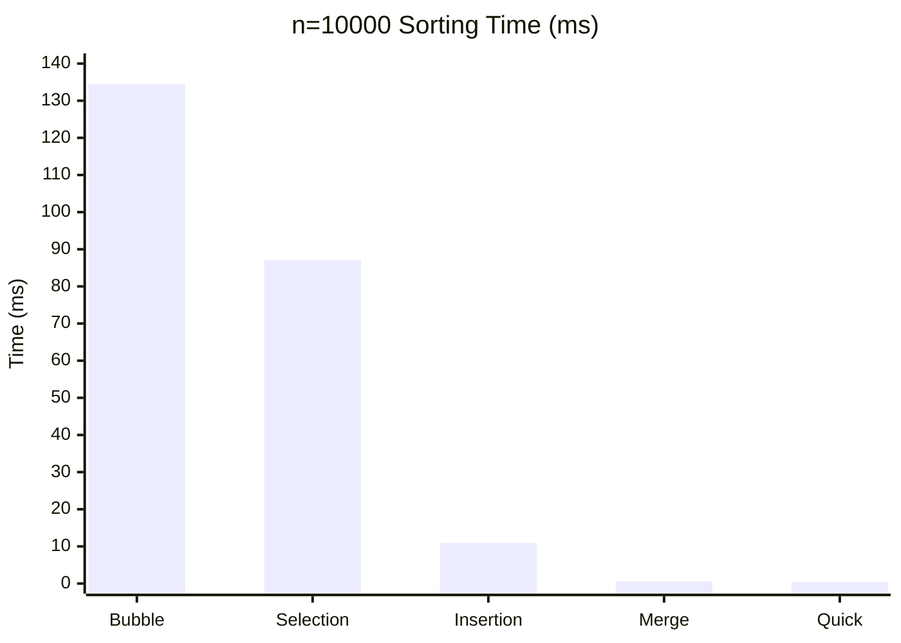
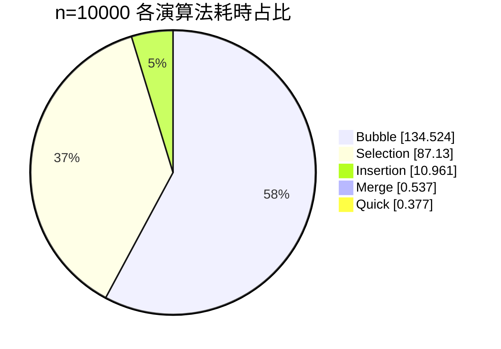

# 排序報告
學號: 11428233  
姓名: 戴翔宥  
模擬頁面: https://sean960215.github.io/sort/  

## 目錄
- [一、前言](#一-前言)
- [二、排序法原理與操作方式](#二-排序法原理與操作方式)
- [三、複雜度分析](#三-複雜度分析)
- [四、實驗設計與數據模擬](#四-實驗設計與數據模擬)
- [五、結果呈現與比較分析](#五-結果呈現與比較分析)
- [六、心得與結論](#六-心得與結論)
- [七、附錄](#七-附錄)

---

## 一、 前言  
排序是演算法中最基礎的一種，在未來的工程問題中是很常被拿來解決問題、優化工作步驟、所需時間的方法之一。而不同的排序法因為不同的排序邏輯與效率，因此也有較適合和較不適合的使用時機。像在處理 10 筆資料時，任何演算法都一樣快；但當資料量來到 100 萬筆時，演算法的選擇就是造成排序需要「幾秒」與「好幾秒甚至幾分鐘」的區別。

---
## 二、 排序法原理與操作方式

### 1. 氣泡排序法 (Bubble Sort)
* **基本原理**：透過兩兩比較、交換相鄰元素，每一輪將最大值放到最後。
* **操作方式**：重複走訪數列，若相鄰兩數順序錯誤則交換，直到沒有任何交換發生。

### 2. 選擇排序法 (Selection Sort)
* **基本原理**：在未排序序列中尋找極值，將其放置於已排序序列的末尾。
* **操作方式**：每一輪掃描未排序部分，找出最小值並與未排序部分的第一個元素交換。

### 3. 插入排序法 (Insertion Sort)
* **基本原理**：模擬撲克牌整理，將資料逐一插入已排序序列的正確位置。
* **操作方式**：從第二個數開始，由後往前掃描已排序部分，找到合適位置後插入並移動其他元素。

### 4. 合併排序法 (Merge Sort)
* **基本原理**：每次都將資料分一半，將一筆資料拆解成最小單位比較完再合併。
* **操作方式**：不斷對半分割數列，直到每個子序列僅剩一個元素，再依序合併成較長的有序序列。

### 5. 快速排序法 (Quick Sort)
* **基本原理**：挑選基準值 (Pivot) 進行分區，將數列分為大於與小於基準值的兩部分。
* **操作方式**：選定 Pivot，重排序列使左側均小於 Pivot、右側均大於 Pivot，再對左右子序列進行遞迴排序。

---

## 三、 複雜度分析

| 排序法 | 平均時間複雜度 | 最壞時間複雜度 | 空間複雜度 | 穩定性 |
| :--- | :--- | :--- | :--- | :--- |
| Bubble Sort | $O(n^2)$ | $O(n^2)$ | $O(1)$ | 穩定 |
| Selection Sort | $O(n^2)$ | $O(n^2)$ | $O(1)$ | 不穩定 |
| Insertion Sort | $O(n^2)$ | $O(n^2)$ | $O(1)$ | 穩定 |
| Merge Sort | $O(n \log n)$ | $O(n \log n)$ | $O(n)$ | 穩定 |
| Quick Sort | $O(n \log n)$ | $O(n^2)$ | $O(\log n)$ | 不穩定 |

---

## 四、 實驗設計與數據模擬

### 1. 實驗設計
* **測試資料**：使用 `srand()` 與 `rand()` 產生之隨機整數。
* **測量指標**：演算法執行所需時間（單位：毫秒 ms）。
* **規模級距**：測試 n = 10、1,000、5,000、10,000 四種資料量。
* **測試環境**：Windows + C 語言，使用 `QueryPerformanceCounter` 進行高精度計時。
* **資料型態**：每組使用隨機整數陣列，觀察不同 n 下時間成長趨勢。

### 2. 實驗流程補充
1. 對每個 n 生成對應大小的隨機資料。
2. 依序執行五種排序法並記錄耗時。
3. 每組 n 重複測試 5 次，取平均值作為最終結果。
4. 將平均結果整理成表格與圖表進行比較。

### 3. 實驗程式碼框架（C）
```c
#include <windows.h>
#include <time.h>

typedef struct {
	const char *name;
	long long comparisons;
	long long swaps;
	double seconds;
} SortResult;

static SortResult run_one_sort(
	const char *name,
	void (*sort_fn)(int[], int, long long *, long long *),
	const int source[],
	int n
) {
	SortResult result = {name, 0, 0, 0.0};
	int *work = (int *)malloc((size_t)n * sizeof(int));
	memcpy(work, source, (size_t)n * sizeof(int));

	LARGE_INTEGER freq, start, end;
	QueryPerformanceFrequency(&freq);
	QueryPerformanceCounter(&start);
	sort_fn(work, n, &result.comparisons, &result.swaps);
	QueryPerformanceCounter(&end);

	result.seconds = (double)(end.QuadPart - start.QuadPart) / (double)freq.QuadPart;
	free(work);
	return result;
}

/* 主流程重點：
   1) 產生隨機陣列
   2) 對 Bubble / Insertion / Selection / Quick / Merge 各跑一次
   3) 輸出 Comparisons、Swaps、Time */
```

上述完整程式包含五種排序函式、比較/交換統計、隨機資料產生與結果表格輸出；
此處保留核心框架，方便在報告中說明實驗方法。

### 4. 數據模擬結果（平均值，單位：ms）
| 資料量 (n) | Bubble | Selection | Insertion | Merge | Quick |
| :--- | :--- | :--- | :--- | :--- | :--- |
| 10 | 0 | 0 | 0 | 0 | 0 |
| 1000 | 1.377 | 0.848 | 0.116 | 0.040 | 0.024 |
| 5000 | 32.025 | 22.451 | 3.513 | 0.251 | 0.178 |
| 10000 | 134.524 | 87.130 | 10.961 | 0.537 | 0.377 |

### 5. 圖表表示

#### (1) n = 10,000 各演算法耗時柱狀圖（ms）


#### (2) n = 10,000 耗時占比圖


#### (3) 成長倍率（n = 1,000 -> n = 10,000）
| 演算法 | 倍率 |
| :--- | :--- |
| Bubble | 97.69 倍 |
| Selection | 102.75 倍 |
| Insertion | 94.49 倍 |
| Merge | 13.43 倍 |
| Quick | 15.71 倍 |

---

## 五、 結果呈現與比較分析

### 1. 效能差異觀察
從實驗結果可發現，當資料量 n 增加時，O(n^2) 級別的排序法（氣泡、選擇、插入）耗時成長非常快；而 O(n log n) 的快速排序與合併排序成長較平緩。

在 n = 10,000 時：
* Quick Sort：0.377 ms（最快）
* Merge Sort：0.537 ms（次快）
* Insertion Sort：10.961 ms
* Selection Sort：87.130 ms
* Bubble Sort：134.524 ms（最慢）

以 Quick Sort 為基準，n = 10,000 的相對耗時約為：
* Bubble：356.83 倍
* Selection：231.11 倍
* Insertion：29.07 倍
* Merge：1.42 倍

### 2. 不同規模的變化
* 在小型數據（n = 1,000）下，各演算法都很快，但 Quick（0.024 ms）與 Merge（0.040 ms）仍明顯領先。
* 由 n = 1,000 增加到 n = 10,000 時，Bubble 與 Selection 約成長 97.69 倍與 102.75 倍，Insertion 成長約 94.49 倍。
* 同區間內，Merge 與 Quick 約成長 13.43 倍與 15.71 倍，符合 O(n log n) 的整體趨勢。

---
## 六、 心得與結論

### 1. 結論
1. 小資料量時，各排序法都可在極短時間完成。
2. 中大型資料量下，快速排序與合併排序明顯優於氣泡、選擇、插入排序。
3. 若需求強調穩定性，可優先考慮合併排序；若追求平均效能，可優先考慮快速排序。

### 2. 心得
這段時間學習了許多排序法，雖然高中就有學過這些排序法的概念了，但透過這次報告的機會可以一起綜合比較這五個不同排序法的優缺點，也讓我對於這些排序法不管是適用時機與運作原理都有更好的概念與基礎。另外，有這些概念我想對於之後要學其他排序法或者搜尋法都有很不錯的基礎幫助。過實作並觀察n=10000的執行時間，從數字就可以明顯感受到，而且這還只是10000個數字，未來遇到更龐大的數據時，系統跑下來的時間、所需的效能一定更懸殊。

---
## 七、 附錄

### 1. 程式碼重點附錄
可附上五種排序法的核心函式與主程式流程，建議至少包含：
1. 隨機資料產生（`srand()`、`rand()`）
2. 計時方法（`QueryPerformanceCounter`）
3. 五種排序函式呼叫順序
4. 結果輸出格式（表格欄位：n、各演算法耗時）

### 2. 平均數據附錄
以下為每組 n 重複 5 次後的平均結果，方便老師檢查數據來源：

| 統計方式 | n | Bubble (ms) | Selection (ms) | Insertion (ms) | Merge (ms) | Quick (ms) |
| :--- | :--- | :--- | :--- | :--- | :--- | :--- |
| 平均（5 次） | 1000 | 1.377 | 0.848 | 0.116 | 0.040 | 0.024 |
| 平均（5 次） | 5000 | 32.025 | 22.451 | 3.513 | 0.251 | 0.178 |
| 平均（5 次） | 10000 | 134.524 | 87.130 | 10.961 | 0.537 | 0.377 |


