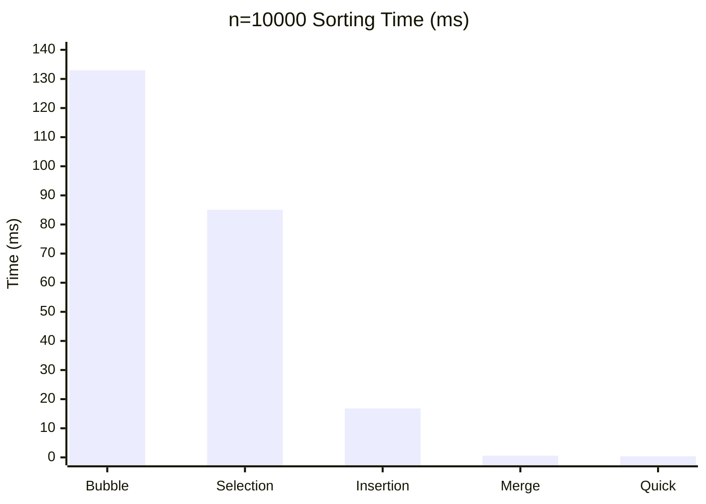
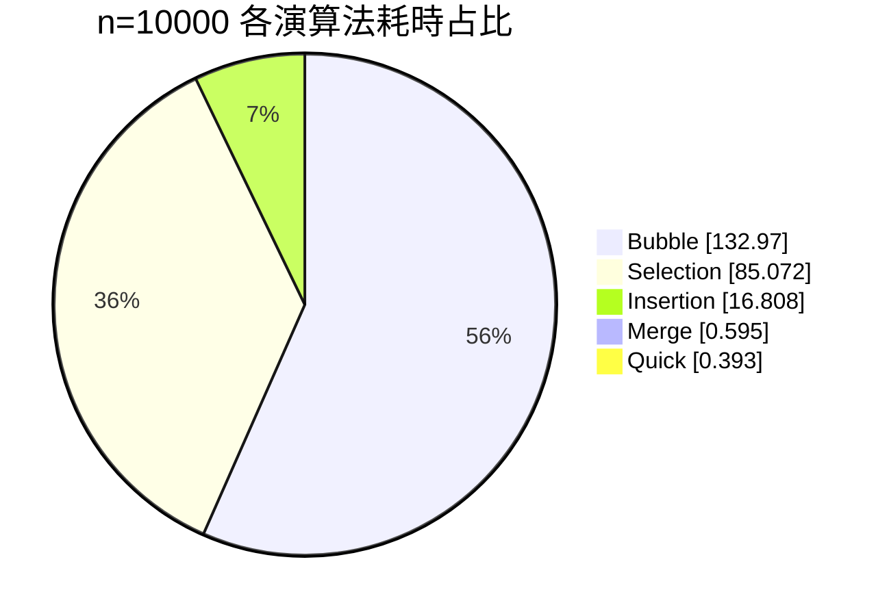

# 排序報告
學號: 11428233  
姓名: 戴翔宥  
模擬頁面: https://sean960215.github.io/sort/  

## 目錄
- [一、前言](#一-前言)
- [二、排序法原理與操作方式](#二-排序法原理與操作方式)
- [三、複雜度分析](#三-複雜度分析)
- [四、實驗設計與數據模擬](#四-實驗設計與數據模擬)
- [五、結果呈現與比較分析](#五-結果呈現與比較分析)
- [六、心得與結論](#六-心得與結論)
- [七、附錄](#七-附錄)

---

## 一、 前言  
排序是演算法中最基礎的一種，在未來的工程問題中是很常被拿來解決問題、優化工作步驟、所需時間的方法之一。而不同的排序法因為不同的排序邏輯與效率，因此也有較適合和較不適合的使用時機。像在處理 10 筆資料時，任何演算法都一樣快；但當資料量來到 100 萬筆時，演算法的選擇就是造成排序需要「幾毫秒」與「幾小時」的區別。

---
## 二、 排序法原理與操作方式

### 1. 氣泡排序法 (Bubble Sort)
* **基本原理**：透過兩兩比較、交換相鄰元素，每一輪將最大值放到最後。
* **操作方式**：重複走訪數列，若相鄰兩數順序錯誤則交換，直到沒有任何交換發生。

### 2. 選擇排序法 (Selection Sort)
* **基本原理**：在未排序序列中尋找極值，將其放置於已排序序列的末尾。
* **操作方式**：每一輪掃描未排序部分，找出最小值並與未排序部分的第一個元素交換。

### 3. 插入排序法 (Insertion Sort)
* **基本原理**：模擬撲克牌整理，將資料逐一插入已排序序列的正確位置。
* **操作方式**：從第二個數開始，由後往前掃描已排序部分，找到合適位置後插入並移動其他元素。

### 4. 合併排序法 (Merge Sort)
* **基本原理**：每次都將資料分一半，將一筆資料拆解成最小單位比較完再合併。
* **操作方式**：不斷對半分割數列，直到每個子序列僅剩一個元素，再依序合併成較長的有序序列。

### 5. 快速排序法 (Quick Sort)
* **基本原理**：挑選基準值 (Pivot) 進行分區，將數列分為大於與小於基準值的兩部分。
* **操作方式**：選定 Pivot，重排序列使左側均小於 Pivot、右側均大於 Pivot，再對左右子序列進行遞迴排序。

---

## 三、 複雜度分析

| 排序法 | 平均時間複雜度 | 最壞時間複雜度 | 空間複雜度 | 穩定性 |
| :--- | :--- | :--- | :--- | :--- |
| Bubble Sort | $O(n^2)$ | $O(n^2)$ | $O(1)$ | 穩定 |
| Selection Sort | $O(n^2)$ | $O(n^2)$ | $O(1)$ | 不穩定 |
| Insertion Sort | $O(n^2)$ | $O(n^2)$ | $O(1)$ | 穩定 |
| Merge Sort | $O(n \log n)$ | $O(n \log n)$ | $O(n)$ | 穩定 |
| Quick Sort | $O(n \log n)$ | $O(n^2)$ | $O(\log n)$ | 不穩定 |

---

## 四、 實驗設計與數據模擬

### 1. 實驗設計
* **測試資料**：使用 `srand()` 與 `rand()` 產生之隨機整數。
* **測量指標**：演算法執行所需時間（單位：毫秒 ms）。
* **規模級距**：測試 n = 10、1,000、5,000、10,000 四種資料量。
* **測試環境**：Windows + C 語言，使用 `QueryPerformanceCounter` 進行高精度計時。
* **資料型態**：每組使用隨機整數陣列，觀察不同 n 下時間成長趨勢。

### 2. 實驗流程補充
1. 對每個 n 生成對應大小的隨機資料。
2. 依序執行五種排序法並記錄耗時。
3. 將結果整理成表格與圖表進行比較。
4. 本版先呈現單次測試結果；若要更嚴謹，可對每組 n 重複 5 次取平均。

### 3. 實驗程式碼框架（C）
```c
#include <windows.h>
#include <time.h>

typedef struct {
	const char *name;
	long long comparisons;
	long long swaps;
	double seconds;
} SortResult;

static SortResult run_one_sort(
	const char *name,
	void (*sort_fn)(int[], int, long long *, long long *),
	const int source[],
	int n
) {
	SortResult result = {name, 0, 0, 0.0};
	int *work = (int *)malloc((size_t)n * sizeof(int));
	memcpy(work, source, (size_t)n * sizeof(int));

	LARGE_INTEGER freq, start, end;
	QueryPerformanceFrequency(&freq);
	QueryPerformanceCounter(&start);
	sort_fn(work, n, &result.comparisons, &result.swaps);
	QueryPerformanceCounter(&end);

	result.seconds = (double)(end.QuadPart - start.QuadPart) / (double)freq.QuadPart;
	free(work);
	return result;
}

/* 主流程重點：
   1) 產生隨機陣列
   2) 對 Bubble / Insertion / Selection / Quick / Merge 各跑一次
   3) 輸出 Comparisons、Swaps、Time */
```

上述完整程式包含五種排序函式、比較/交換統計、隨機資料產生與結果表格輸出；
此處保留核心框架，方便在報告中說明實驗方法。

### 4. 數據模擬結果 (單位：ms)
| 資料量 (n) | Bubble | Selection | Insertion | Merge | Quick |
| :--- | :--- | :--- | :--- | :--- | :--- |
| 10 | 0 | 0 | 0 | 0 | 0 |
| 1000 | 1.338 | 0.854 | 0.123 | 0.047 | 0.031 |
| 5000 | 31.225 | 22.13 | 3.085 | 0.299 | 0.185 |
| 10000 | 132.97 | 85.072 | 16.808 | 0.595 | 0.393 |

### 5. 圖表表示

#### (1) n = 10,000 各演算法耗時柱狀圖（ms）


#### (2) n = 10,000 耗時占比圖


#### (3) 成長倍率（n = 1,000 -> n = 10,000）
| 演算法 | 倍率 |
| :--- | :--- |
| Bubble | 99.38 倍 |
| Selection | 99.62 倍 |
| Insertion | 136.65 倍 |
| Merge | 12.66 倍 |
| Quick | 12.68 倍 |

---

## 五、 結果呈現與比較分析

### 1. 效能差異觀察
從實驗結果可發現，當資料量 n 增加時，O(n^2) 級別的排序法（氣泡、選擇、插入）耗時成長非常快；而 O(n log n) 的快速排序與合併排序成長較平緩。

在 n = 10,000 時：
* Quick Sort：0.393 ms（最快）
* Merge Sort：0.595 ms（次快）
* Insertion Sort：16.808 ms
* Selection Sort：85.072 ms
* Bubble Sort：132.97 ms（最慢）

以 Quick Sort 為基準，n = 10,000 的相對耗時約為：
* Bubble：338.35 倍
* Selection：216.47 倍
* Insertion：42.77 倍
* Merge：1.51 倍

### 2. 不同規模的變化
* 在小型數據（n = 1,000）下，各演算法都很快，但 Quick（0.031 ms）與 Merge（0.047 ms）仍明顯領先。
* 由 n = 1,000 增加到 n = 10,000 時，Bubble 與 Selection 約成長 100 倍，Insertion 成長約 136.65 倍。
* 同區間內，Merge 與 Quick 僅約成長 12.66 倍與 12.68 倍，符合 O(n log n) 的趨勢。

---
## 六、 心得與結論

### 1. 心得
透過這次比較可以明顯看出，排序法的理論複雜度不只是數學符號，而是會直接反映在實測時間上。當資料量變大時，O(n^2) 與 O(n log n) 的差距非常明顯，讓我更理解「演算法選擇」對效能的關鍵影響。

### 2. 結論
1. 小資料量時，各排序法都可在極短時間完成，但快速排序與合併排序仍有優勢。
2. 中大型資料量下，快速排序與合併排序明顯優於氣泡、選擇、插入排序。
3. 若需求強調穩定性，可優先考慮合併排序；若追求平均效能，可優先考慮快速排序。
4. 本報告已完成五個作業要求：排序法介紹、複雜度分析、數據模擬、結果比較、心得結論。

---

## 七、 附錄

### 1. 程式碼附錄
附錄可放完整程式碼，包含五種排序法的實作、隨機資料產生、計時與結果輸出。本文第四章已列出實驗程式碼框架，若老師需要檢查細節，可將完整原始碼一併附上。

### 2. 圖片附錄
可附上互動頁面執行截圖，例如：
* 排序動畫畫面
* 步驟記錄畫面
* 實驗結果表格畫面

### 3. 原始數據附錄
若有完整多次測試結果，也可放在附錄，讓報告主文保持精簡，同時保留查核依據。